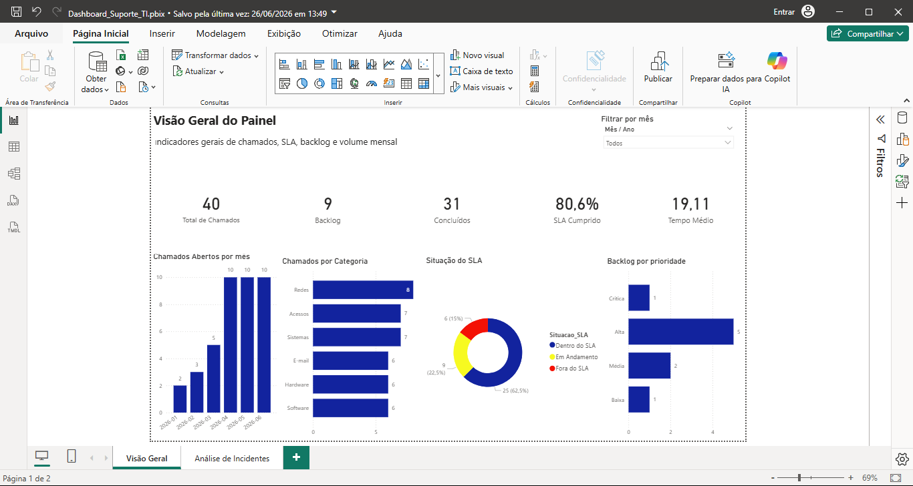
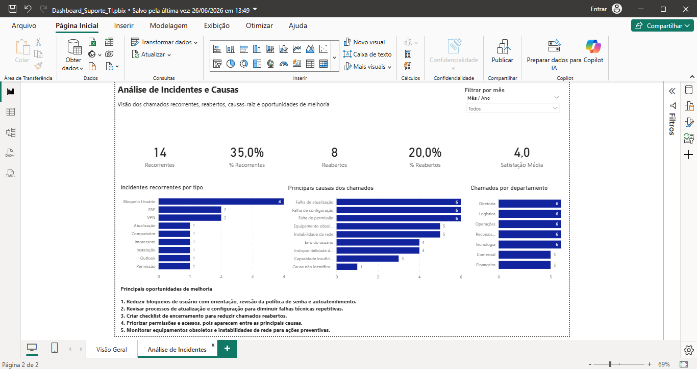

# Dashboard de Suporte TI — Power BI

Projeto desenvolvido em Power BI para análise de chamados de suporte técnico, com foco em SLA, backlog, tempo médio de resolução, incidentes recorrentes, causas-raiz, chamados reabertos e satisfação dos usuários.

## Objetivo do projeto

Simular uma operação de suporte de TI e acompanhar indicadores operacionais que ajudem a gestão a identificar gargalos, priorizar chamados críticos e propor melhorias nos processos de atendimento.

## Ferramentas utilizadas

* Excel
* Power BI
* Power Query
* DAX
* Modelagem de dados
* Tabela calendário
* Dimensão de prioridade

## Indicadores analisados

* Total de chamados
* Chamados concluídos
* Backlog
* Percentual de SLA cumprido
* Tempo médio de resolução
* Chamados dentro e fora do SLA
* Incidentes recorrentes
* Chamados reabertos
* Nota média de satisfação
* Principais causas dos chamados
* Chamados por departamento
* Backlog por prioridade

## Resultados da análise

* 40 chamados registrados
* 31 chamados concluídos
* 9 chamados em backlog
* 80,6% de cumprimento de SLA
* Tempo médio de resolução de 19,11 horas
* 35% de chamados recorrentes
* 20% de chamados reabertos
* Nota média de satisfação de 4,0

## Principais insights

A análise mostrou que bloqueio de usuário foi o incidente recorrente mais frequente, indicando oportunidade para orientação aos usuários, revisão da política de senha e possível criação de autoatendimento.

Também foram identificadas causas recorrentes relacionadas a falhas de atualização, falhas de configuração, permissões, equipamentos obsoletos e instabilidades de rede.

O backlog apresentou concentração em chamados de prioridade alta, indicando necessidade de atenção operacional para evitar impacto no atendimento.

## Estrutura do projeto

* `Base_Chamados_Suporte.xlsx`: base fictícia de chamados utilizada no projeto.
* `Dashboard_Suporte_TI.pbix`: arquivo do Power BI.
* `Dashboard_Suporte_TI.pdf`: versão exportada do dashboard.
* `/imagens`: capturas das páginas do dashboard.

## Imagens do dashboard

### Visão Geral

### Análise de Incidentes

## Como visualizar o projeto

- Baixe o arquivo `.pbix` para abrir o dashboard no Power BI Desktop.
- Consulte o arquivo `.pdf` para visualizar uma versão estática do painel.
- A base fictícia utilizada no projeto está disponível no arquivo Excel.

## Autor

Caio Cesar Martins
Profissional de TI com experiência em suporte técnico, sustentação de sistemas, SQL, Power BI, Excel, Power Query, análise de indicadores e melhoria de processos.
